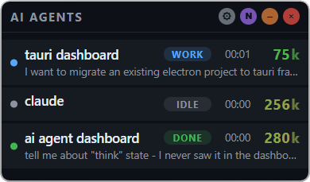

# AI Agent Dashboard

*A real-time desktop widget that tracks what your AI coding agents are doing.*

Anything that can POST JSON to `localhost` can report status. Each session appears as a row in a compact always-on-top window, with a state pill that transitions between WORK / WAIT / IDLE / DONE / ERROR, a live timer, and a token counter colored by how close the session is to its context limit.

**[Claude Code](https://anothersava.github.io/tauri-dashboard/pages/claude-code)** — First-class integration via lifecycle hooks in `~/.claude/settings.json`. Each Claude Code session becomes a row named after its working directory, with state tracked through SessionStart / UserPromptSubmit / Notification / Stop / SessionEnd events. A transcript watcher tails each session's JSONL to update token counts live between hook firings.

**[HTTP API](https://anothersava.github.io/tauri-dashboard/pages/http-api)** — A generic POST endpoint for any tool, language, or CI script that can send JSON. A three-line curl is enough, and the payload format is the same as Claude Code's.

---

Download the latest `AI Agent Dashboard_<version>_x64-setup.exe` from the [Releases page](https://github.com/AnotherSava/tauri-dashboard/releases). Windows 10 version 1803 or newer; WebView2 is fetched during install if missing.

See full project documentation at **[anothersava.github.io/tauri-dashboard](https://anothersava.github.io/tauri-dashboard/)**:

- [Installation and usage](https://anothersava.github.io/tauri-dashboard/)
  - [Claude Code](https://anothersava.github.io/tauri-dashboard/pages/claude-code)
  - [HTTP API](https://anothersava.github.io/tauri-dashboard/pages/http-api)
- [Developer guide](https://anothersava.github.io/tauri-dashboard/pages/development)
