# Field flow reference

A stage-by-stage catalog of every field that enters or exits the pipeline between Claude Code and `AgentSession`. Each stage lists its fields, marks what happens to them at the next boundary, and quotes the code with `file:line` refs so future refactors can tell intentional drops from oversights.

Use this alongside [`docs/pages/data-flow.md`](../../pages/data-flow.md) (narrative) and [`docs/pages/http-api.md`](../../pages/http-api.md) (public wire format). Those describe *what the system does*; this one is the ledger of *what fields exist at each hop*.

Two parallel input paths merge into `AgentSession`:



Source: `field-flow.mmd`. Regenerate with `npx -y -p @mermaid-js/mermaid-cli mmdc -i docs/plans/draft/field-flow.mmd -o docs/plans/draft/field-flow.svg -b white`.

---

## Stage 0 — Claude Code → hook stdin

Source: Claude Code's [hooks system](https://docs.claude.com/en/docs/claude-code/hooks). What Claude sends depends on which lifecycle event fired. We subscribe to five events in [`docs/pages/claude-code.md`](../../pages/claude-code.md):

| Hook event          | argv to `claude_hook.py` | Payload fields we read                                                 |
|---                  |---                       |---                                                                     |
| `SessionStart`      | `idle`                   | `session_id`, `cwd`, `transcript_path`                                 |
| `UserPromptSubmit`  | `working`                | `session_id`, `cwd`, `transcript_path`, **`prompt`**                   |
| `Notification`      | `idle`                   | `session_id`, `cwd`, `transcript_path`, `notification_type`, `message` |
| `Stop`              | `done`                   | `session_id`, `cwd`, `transcript_path`                                 |
| `SessionEnd`        | `clear`                  | `session_id`, `cwd`                                                    |

Fields Claude Code supplies that we **never read** today (non-exhaustive, based on Claude Code's documented hook schema):

- `hook_event_name` — the event name, redundant since argv already carries the mapped arg
- `tool_name`, `tool_input`, `tool_response` — only on `PreToolUse` / `PostToolUse` (not subscribed)
- `stop_hook_active` — reentry guard flag
- `matcher`, `permission_mode`, `trigger` — metadata on how the hook was selected
- Any Claude-side timestamps

`claude_hook.py:222-224` uses `json.load(sys.stdin)` and silently tolerates malformed JSON by substituting `{}`, so unknown fields are simply ignored rather than rejected.

---

## Stage 1 — `claude_hook.py`: payload → HTTP body

Entry point: `main()` at `integrations/claude_hook.py:211`. Inputs: argv (`arg`), stdin payload, `config.json` (for `projects_root`, `benign_closers`, `server_port`).

### Derived values

| Derived field   | Source                                       | Where                                          | Notes |
|---              |---                                           |---                                             |---|
| `chat_id`       | `cwd` relative to `projects_root`            | `derive_chat_id()` at `claude_hook.py:67-77`   | Slashes / dashes / underscores become spaces. Falls back to basename(cwd), then `claude-<session_id[:8]>`. |
| `status`        | `arg` + `payload.notification_type` + transcript tail | `classify()` at `claude_hook.py:149-176` | See classify table below. |
| `label`         | `payload.prompt` OR `payload.message` OR `"has a question"` | `classify()` + `_clean_prompt()` + `_notification_label()` | Conditional; may be `None`. |

### `classify()` decision table (`claude_hook.py:149-176`)

| `arg`     | Branch condition                                      | Emitted `status` | Emitted `label`                                             |
|---        |---                                                    |---               |---                                                          |
| `working` | `prompt` is a non-empty string                        | `working`        | `_clean_prompt(prompt)` — full text, whitespace normalized  |
| `working` | no `prompt`                                           | `working`        | `None` (widget preserves prior label)                       |
| `done`    | last assistant text ends with `?` and isn't a benign closer | `awaiting` | `"has a question"`                                          |
| `done`    | otherwise                                             | `done`           | `None`                                                      |
| `idle`    | no `notification_type` and no `message`               | `idle`           | `None`                                                      |
| `idle`    | `notification_type == "idle_prompt"` + trailing `?`   | `awaiting`       | `"has a question"`                                          |
| `idle`    | `notification_type == "idle_prompt"` + no `?`         | `done`           | `None`                                                      |
| `idle`    | any other notification                                | `awaiting`       | `_notification_label(payload)`, cleaned, **truncated to 60 chars** (`claude_hook.py:175`) |
| `clear`   | —                                                     | —                | — (body shape differs — see below)                          |

### `_clean_prompt()` transformations (`claude_hook.py:129-135`)

1. Replace `\n\r\t\v\f` with spaces
2. Translate out `U+2300–U+23FF` (Misc Technical incl. `⎿`) and `U+2500–U+259F` (Box Drawing / Block Elements) to spaces — Claude Code's terminal chrome
3. Collapse runs of multiple spaces
4. Strip leading/trailing whitespace

**Not applied:** length truncation (except in the notification path), URL redaction, Markdown stripping. Emoji and CJK pass through.

### HTTP body shape (`build_body()` at `claude_hook.py:179-195`)

**`set` action:**
```json
{
  "action": "set",
  "id": "<chat_id>",
  "status": "working | awaiting | idle | done",
  "source": "claude",
  "updated": 1234567890123,
  "transcript_path": "/.../transcript.jsonl",
  "label": "cleaned prompt"
}
```

**`clear` action:**
```json
{"action": "clear", "id": "<chat_id>"}
```

### Fields dropped at Stage 1

| Claude Code field        | What the hook does with it |
|---                       |---                         |
| `cwd`                    | Consumed by `derive_chat_id`, then discarded |
| `session_id`             | Fallback for `chat_id`, then discarded |
| `hook_event_name`        | Ignored (argv is authoritative) |
| `stop_hook_active`       | Ignored |
| Any Claude timestamps    | Ignored (hook uses `time.time()*1000`) |
| Permission-prompt detail | The `"use <tool>"` substring after `_notification_label()` is reduced to `"needs approval: <tool>"` at `claude_hook.py:141-143`; original `message` text is dropped |
| `notification_type` (other than `idle_prompt` / `permission_prompt` / `plan_approval`) | Passes through via the `message` field, truncated to 60 chars |

### Fields *added* at Stage 1

- `id` (derived chat_id)
- `action` (`set` or `clear`)
- `source` (`"claude"`, hardcoded)
- `updated` (hook-side `int(time.time()*1000)`)

---

## Stage 2 — HTTP wire → `SetPayload`

Entry point: `post_status()` at `src-tauri/src/http_server.rs:95`. Deserializes into `StatusRequest` at `http_server.rs:42-46` (enum tagged by `action`), which branches to `SetPayload` (`http_server.rs:48-60`), `ClearPayload`, or `Config`.

### `SetPayload` fields

| Field                | JSON name         | Type                | Handling                                                    |
|---                   |---                |---                  |---                                                          |
| `id`                 | `id`              | `String`            | Required. Used as session key and watcher key.              |
| `status`             | `status`          | `Status` enum       | Required. One of `idle / working / awaiting / done / error`. |
| `label`              | `label`           | `Option<String>`    | Optional. `None` = preserve prior label (by design).        |
| `source`             | `source`          | `Option<String>`    | Defaults to `"claude-code"` on session creation.            |
| `model`              | `model`           | `Option<String>`    | Not sent by our hook today; reserved for other agents.      |
| `input_tokens`       | `inputTokens`     | `Option<u64>`       | Not sent by our hook today; the transcript watcher fills this. |
| `transcript_path`    | `transcript_path` | `Option<String>`    | Extracted but **not** stored on the session.                |
| `_updated`           | `updated`         | `Option<i64>`       | **Deliberately discarded.** The leading underscore is the tell. |

### Transformations at Stage 2

- **Origin guard** (`http_server.rs:102-107`): non-`null` `Origin` header → `403`.
- **Timestamp rewrite:** `SetPayload._updated` is ignored; server substitutes `now_ms()` at `http_server.rs:125`. This guarantees monotonic ordering relative to the widget's own clock.
- **`transcript_path` side effect** (`http_server.rs:127-131`): used to bootstrap a per-session `WatcherRegistry` entry; never stored on `AgentSession`. If the widget restarts, the path is lost until the hook resends it on the next event.
- **`Config` action** (`http_server.rs:139-142`): short-circuits with `204` before ever touching `AppState`.

---

## Stage 3 — `SetPayload` → `SetInput` → `AgentSession`

### `SetInput` (`src-tauri/src/state.rs:29-39`)

Constructed in `post_status` at `http_server.rs:117-124`. Carries forward: `id`, `status`, `label`, `source`, `model`, `input_tokens`. **Drops:** `transcript_path` (diverted above), `_updated` (already dropped).

### `AgentSession` (`state.rs:14-26`)

Full field list:

| Field                      | Source                                   | Updated when                                         |
|---                         |---                                       |---                                                   |
| `id`                       | `SetInput.id`                            | Creation only (session lookup key)                   |
| `status`                   | `SetInput.status`                        | Every `apply_set`                                    |
| `label`                    | `SetInput.label` (if `Some`)             | `apply_set` when label is provided; preserved otherwise |
| `original_prompt`          | Derived from `label` on task boundary    | `Done|Idle → Working` transitions; preserved otherwise |
| `source`                   | `SetInput.source` (if `Some`)            | Falls back to `"claude-code"` on new session         |
| `model`                    | `SetInput.model` OR watcher inference    | Whichever arrives; watcher upgrade-only              |
| `input_tokens`             | `SetInput.input_tokens` OR watcher sum   | Whichever arrives; watcher upgrade-only              |
| `updated`                  | Server `now_ms()`                        | Every mutation                                       |
| `state_entered_at`         | Server `now_ms()` on status change       | Status transitions only                              |
| `working_accumulated_ms`   | Derived: time-in-Working accumulator     | Incremented when leaving Working; zeroed on task boundary |

### `apply_set` decision points (`state.rs:55-110`)

```rust
// state.rs:60-63 — leaving Working: bank elapsed time
if prior == Status::Working && input.status != Status::Working {
    let delta = (now_ms - existing.state_entered_at).max(0) as u64;
    existing.working_accumulated_ms =
        existing.working_accumulated_ms.saturating_add(delta);
}

// state.rs:65-72 — entering Working from Done/Idle: new task boundary
let task_boundary =
    matches!(prior, Status::Done | Status::Idle) && input.status == Status::Working;
if task_boundary {
    if let Some(ref l) = input.label {
        existing.original_prompt = Some(l.clone());
    }
    existing.working_accumulated_ms = 0;
}
```

### Fields dropped at Stage 3

None. Every `SetInput` field lands on `AgentSession` (possibly conditionally).

---

## Parallel path — transcript JSONL → `InferredState`

Source: `src-tauri/src/log_watcher.rs`. Bootstrapped from `transcript_path` in `SetPayload`.

### Fields extracted per JSONL line (`log_watcher.rs:154-182`)

| Field                                | JSON path                                         |
|---                                   |---                                                |
| `entry_type`                         | `type`                                            |
| `is_sidechain`                       | `isSidechain`                                     |
| `message.model`                      | `message.model`                                   |
| `message.content[].block_type`       | `message.content[].type`                          |
| `message.content[].text`             | `message.content[].text`                          |
| `message.usage.input_tokens`         | `message.usage.input_tokens`                      |
| `message.usage.cache_creation_input_tokens` | `message.usage.cache_creation_input_tokens`  |
| `message.usage.cache_read_input_tokens` | `message.usage.cache_read_input_tokens`        |

### `InferredState` (`log_watcher.rs:16-20`)

```rust
pub struct InferredState {
    pub state: Option<Status>,        // Working or Done only
    pub model: Option<String>,        // claude-* only
    pub input_tokens: Option<u64>,    // sum of input + cache_creation + cache_read
}
```

### Transformations

- **Non-conversational entries skipped** (`log_watcher.rs:33`): `entry.entry_type != "user" && entry.entry_type != "assistant"` → `continue`. Tool-system-output records, init records, and synthetic error records are filtered out.
- **Sidechains excluded from model/usage** (`log_watcher.rs:53`): `Task`-launched sub-agents have their own context window; including their tokens would mislabel the parent session.
- **Non-Claude models rejected** (`log_watcher.rs:56`): `m.starts_with("claude-")` — synthetic error entries often have a non-Claude model string.
- **State inference** (`log_watcher.rs:73-87`):
  - any `tool_use` or `tool_result` block → `Working`
  - `user` entry with non-empty text → `Working`
  - `assistant` entry with non-empty text → `Done`
- **Newest-first scan with early exit** (`log_watcher.rs:28, 89-92`): reverse iteration, break when all three dimensions are filled.

### `apply_watcher_update` (`log_watcher.rs:117-150`) — upgrade-only merge

Can only:
- Set `status = Working` when session is not currently `Working`
- Update `model` (if different)
- Update `input_tokens` (if different)

**Cannot** set `Done`, `Idle`, `Awaiting`, `Error` — those stay hook-authoritative.

### Fields *never* read from the transcript

User prompts (`message.content[].text` on `user` entries is inspected for emptiness but the text itself is discarded), tool names, tool inputs, tool outputs, thinking blocks, system-reminder blocks, slash command invocations, attachment metadata.

---

## Summary: drops & transforms at a glance

| From → To                              | Dropped                                                                                                                                                           | Transformed                                                                  |
|---                                     |---                                                                                                                                                                |---                                                                           |
| Claude Code → `claude_hook.py`         | `hook_event_name`, `stop_hook_active`, any Claude timestamps, most of `message` in permission prompts, `tool_*` fields (hooks not subscribed), `PreToolUse` / `PostToolUse` events entirely | — |
| `claude_hook.py` → HTTP body           | Notification `message` text > 60 chars                                                                                                                            | `_clean_prompt` chrome-stripping and whitespace collapse on `prompt` / `message` |
| HTTP → `SetInput` (axum)               | `transcript_path` (diverted to watcher), `_updated` (discarded), any extra JSON fields (serde ignores them)                                                       | Server clock replaces hook timestamp                                         |
| `SetInput` → `AgentSession`            | None                                                                                                                                                              | Derived `original_prompt`, `updated`, `state_entered_at`, `working_accumulated_ms` |
| Transcript → `InferredState`           | Prompt text, tool names, tool inputs/outputs, thinking blocks, sidechain model/usage, non-Claude models                                                           | Token fields summed; state collapsed to `Working`/`Done` only                |
| `InferredState` → `AgentSession`       | Everything when status is already terminal (upgrade-only)                                                                                                         | Only `Working` status; `model` / `input_tokens` straight copy                |

---

## Candidates worth revisiting

None of these are open tasks — just places where the field loss is by convention rather than by requirement, for anyone designing the richer sticky-label policy:

1. **`transcript_path` on `AgentSession`** — currently only used as a watcher bootstrap. Persisting it would let the widget restart without losing transcript tails until the next hook fires.
2. **Notification 60-char truncation** — silently drops the tail of longer messages. The header has more room than 60ch most of the time.
3. **`PreToolUse` / `PostToolUse` subscription** — would give us live "running: bash" / "editing: foo.py" labels that today we can only approximate from the transcript.
4. **Prompt logging** — no `tracing::*` call on `post_status` means incoming prompts are invisible to `widget.log`.
5. **Tool-name extraction from the transcript** — `log_watcher::infer_state` walks blocks but never reads `tool_name` / `tool_input.command`; a richer label policy could use this for the work-item display instead of relying on the sticky `original_prompt` alone.
